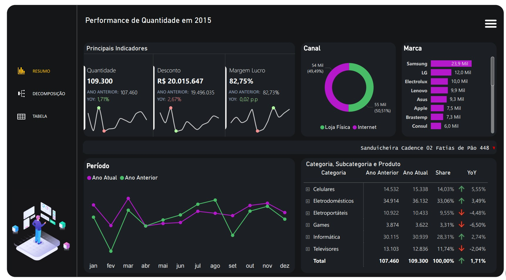
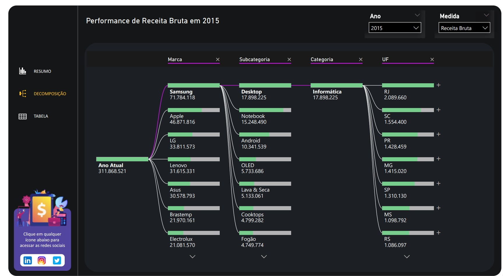
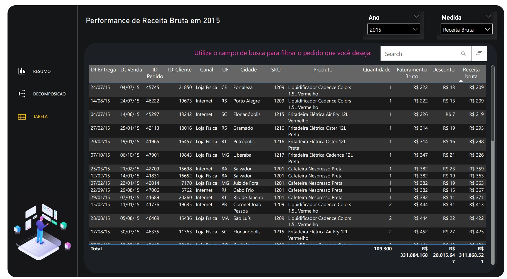
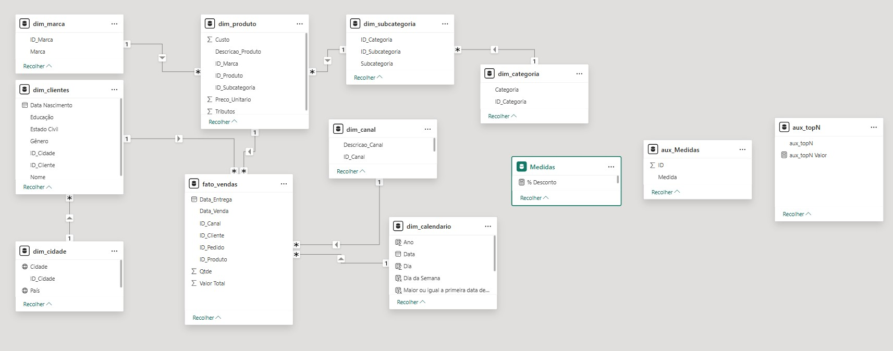

# Análise Comercial — Dashboard em Power BI

## Visão geral do dashboard



## Análise de decomposição



## Tabela de análise



## Modelo de dados



## Sobre o projeto

Este projeto consiste em um dashboard de análise comercial desenvolvido no Power BI com o objetivo de explorar e analisar o desempenho de vendas a partir de diferentes perspectivas, como produto, categoria, canal de venda, região e período de tempo.

A ideia foi construir um modelo de dados estruturado que permitisse responder perguntas reais de negócio e gerar insights sobre o comportamento das vendas. O dashboard permite acompanhar indicadores como faturamento, receita líquida, margem, quantidade vendida e evolução ao longo do tempo.

O projeto também foi pensado como um exercício completo de modelagem analítica, incluindo preparação de dados no Power Query, modelagem em Star Schema e criação de métricas em DAX.

---

## Objetivo

O objetivo principal foi construir um modelo analítico capaz de responder perguntas de negócio comuns em análises comerciais, como por exemplo:

- Quais categorias geram maior faturamento?
- Quais produtos possuem melhor desempenho de vendas?
- Como as vendas evoluem ao longo do tempo?
- Existe diferença relevante em relação ao ano anterior?
- Qual o impacto de custos, tributos e descontos na receita final?
- Quais canais de venda apresentam melhor desempenho?

---

## Dataset

Os dados utilizados neste projeto são **fictícios** e foram utilizados apenas para fins de estudo e demonstração de técnicas de análise de dados.

O dataset simula uma base comercial contendo:

- pedidos
- produtos
- clientes
- canais de venda
- categorias e subcategorias
- cidades
- calendário de datas

Essas informações permitem construir análises multidimensionais típicas de ambientes de Business Intelligence.

---

## Estrutura do modelo de dados

O modelo foi construído seguindo o padrão **Star Schema**, separando claramente tabelas fato e tabelas dimensão.

Essa abordagem facilita a navegação do modelo, melhora a performance das consultas e permite análises mais flexíveis.

### Tabela fato

#### fato_vendas

Contém os registros de vendas.

Principais campos:

- Data_Venda
- Data_Entrega
- ID_Cliente
- ID_Produto
- ID_Canal
- ID_Pedido
- Qtde
- Valor Total

---

### Tabelas dimensão

#### dim_produto

Informações de produtos.

Campos principais:

- Descricao_Produto
- ID_Marca
- ID_Subcategoria
- Custo
- Preco_Unitario
- Tributos

#### dim_subcategoria

- ID_Subcategoria
- ID_Categoria
- Subcategoria

#### dim_categoria

- ID_Categoria
- Categoria

#### dim_marca

- ID_Marca
- Marca

#### dim_clientes

Informações demográficas dos clientes.

- ID_Cliente
- Nome
- Gênero
- Estado Civil
- Educação
- Data de Nascimento
- ID_Cidade

#### dim_cidade

- ID_Cidade
- Cidade
- País

#### dim_canal

Define o canal de vendas.

Exemplos:

- Loja física
- Internet

#### dim_calendario

Tabela de datas utilizada para análises temporais.

Campos principais:

- Data
- Ano
- Dia
- Dia da semana

---

## Transformação e preparação dos dados

A preparação dos dados foi realizada no **Power Query**.

Entre as principais etapas de transformação:

- definição e correção de tipos de dados
- remoção de colunas desnecessárias
- expansão de colunas provenientes de consultas auxiliares
- aplicação de funções personalizadas
- consolidação de dados na tabela fato
- importação e tratamento de arquivos externos

Esse processo foi importante para garantir consistência e qualidade nos dados antes da modelagem.

---

## Modelagem

Os principais relacionamentos do modelo são:

- dim_cliente → fato_vendas
- dim_produto → fato_vendas
- dim_canal → fato_vendas
- dim_calendario → fato_vendas
- dim_cidade → dim_clientes
- dim_categoria → dim_subcategoria → dim_produto
- dim_marca → dim_produto

Essa estrutura permite análises cruzando diferentes dimensões do negócio.

---

## Métricas criadas (DAX)

O dashboard utiliza diversas medidas criadas em **DAX** para cálculo de indicadores de performance.

### Indicadores principais

- Faturamento bruto
- Receita bruta
- Receita líquida
- Custos
- Tributos
- Margem
- Quantidade vendida
- Ticket médio

---

### Inteligência temporal

Também foram criadas medidas de comparação com períodos anteriores, como:

- Receita LY (Last Year)
- Margem LY
- Quantidade LY
- Receita Bruta LY
- Custos LY

Além disso, foram utilizadas comparações:

- Year over Year (YoY)
- Month over Month (MoM)

---

### Medidas dinâmicas

Foi implementado um sistema de métricas dinâmicas que permite trocar o indicador analisado dentro do dashboard sem alterar os visuais.

Exemplo de lógica utilizada:

```DAX
VAR MedidaSelecionada = SELECTEDVALUE(aux_Medidas[Medida])
